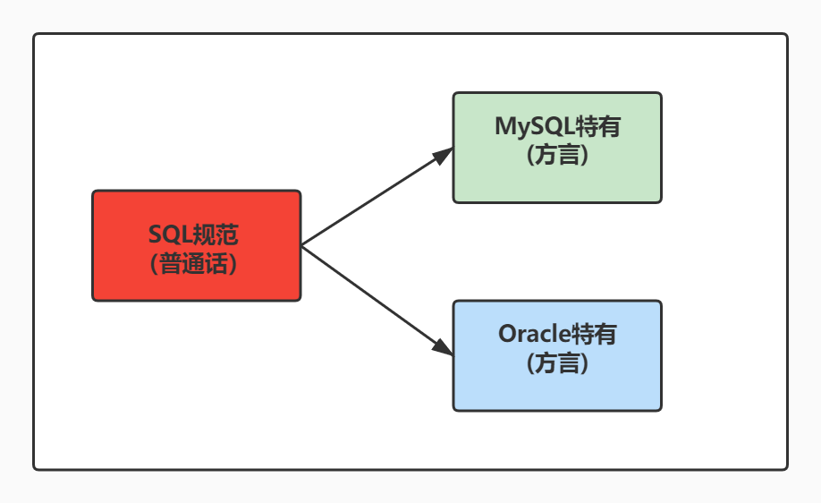

# 第03章_基本的SELECT语句

***

## 1. SQL概述

### 1.1 SQL背景知识

- 1946 年，世界上第一台电脑诞生，如今，借由这台电脑发展起来的互联网已经自成江湖。在这几十年里，无数的技术、产业在这片江湖里沉浮，有的方兴未艾，有的已经几幕兴衰。但在这片浩荡的波动里，有一门技术从未消失，甚至“老当益壮”，那就是 SQL。
  - 45 年前，也就是 1974 年，IBM 研究员发布了一篇揭开数据库技术的论文《SEQUEL：一门结构化的英语查询语言》，直到今天这门结构化的查询语言并没有太大的变化，相比于其他语言，`SQL 的半衰期可以说是非常长`了。

- 不论是前端工程师，还是后端算法工程师，都一定会和数据打交道，都需要了解如何又快又准确地提取自己想要的数据。更别提数据分析师了，他们的工作就是和数据打交道，整理不同的报告，以便指导业务决策。

- SQL（Structured Query Language，结构化查询语言）是使用关系模型的数据库应用语言，`与数据直接打交道`，由`IBM`上世纪70年代开发出来。后由美国国家标准局（ANSI）开始着手制定SQL标准，先后有`SQL-86`，`SQL-89`，`SQL-92`，`SQL-99`等标准。
  - SQL 有两个重要的标准，分别是 SQL92 和 SQL99，它们分别代表了 92 年和 99 年颁布的 SQL 标准，我们今天使用的 SQL 语言依然遵循这些标准。

- 不同的数据库生产厂商都支持SQL语句，但都有特有内容。



### 1.2 SQL语言排行榜

自从 SQL 加入了 TIOBE 编程语言排行榜，就一直保持在 Top 10。


### 1.3 SQL 分类

SQL语言在功能上主要分为如下3大类：

- **DDL（Data Definition Languages、数据定义语言）**，这些语句定义了不同的数据库、表、视图、索引等数据库对象，还可以用来创建、删除、修改数据库和数据表的结构。
  - 主要的语句关键字包括`CREATE`、`DROP`、`ALTER`等。

- **DML（Data Manipulation Language、数据操作语言）**，用于添加、删除、更新和查询数据库记录，并检查数据完整性。
  - 主要的语句关键字包括`INSERT`、`DELETE`、`UPDATE`、`SELECT`等。
  - **SELECT是SQL语言的基础，最为重要。**

- **DCL（Data Control Language、数据控制语言）**，用于定义数据库、表、字段、用户的访问权限和安全级别。
  - 主要的语句关键字包括`GRANT`、`REVOKE`、`COMMIT`、`ROLLBACK`、`SAVEPOINT`等。

因为查询语句使用的非常的频繁，所以很多人把查询语句单拎出来一类：DQL（数据查询语言）。

- **DQL(Data Query Language)数据查询语言**，数据检索语句，用于从表中获取数据。关键字有：select。
  - ​	select 查询

还有单独将`COMMIT`、`ROLLBACK` 取出来称为TCL （Transaction Control Language，事务控制语言）。

- **TCL(Transaction Control Language)事务控制语句**，用于控制事务。主要的语句关键字有：commit、rollback、savepoint、set transaction。
  - ​	Rollback语句：用于事务的回退操作。
  - ​	Savepoint语句：为回退而存在,个数没有限制,与虚拟机中快照类似。savepoint是事务中的一点。用于取消部分事务，当结束事务时，会自动的删除该事务中所定义的所有保存点。
  - ​	Commit语句：用于提交事务。
  - ​	Set transaction语句：设置事务的各种状态，比如只读、读/写、隔离级别。

> 参考资料：【数据库中DQL、DML、DDL、DCL、TCL概述】https://blog.csdn.net/weixin_44169484/article/details/119255935


## 2、SQL语言的规则与规范

### 2.1  基本规则

- SQL 可以写在一行或者多行。为了提高可读性，各子句分行写，必要时使用缩进
- 每条命令以 ; 或 \g 或 \G 结束
- 关键字不能被缩写也不能分行
- 关于标点符号
  - 必须保证所有的()、单引号、双引号是成对结束的
  - 必须使用英文状态下的半角输入方式
  - 字符串型和日期时间类型的数据可以使用单引号（' '）表示
  - 列的别名，尽量使用双引号（" "），而且不建议省略as

### 2.2 SQL大小写规范 （建议遵守）

- **MySQL 在 Windows 环境下是大小写不敏感的**
- **MySQL 在 Linux 环境下是大小写敏感的**
  - 数据库名、表名、表的别名、变量名是严格区分大小写的
  - 关键字、函数名、列名(或字段名)、列的别名(字段的别名) 是忽略大小写的。
- **推荐采用统一的书写规范：**
  - 数据库名、表名、表别名、字段名、字段别名等都小写
  - SQL 关键字、函数名、绑定变量等都大写

### 2.3 注 释

可以使用如下格式的注释结构

```mysql
单行注释：#注释文字(MySQL特有的方式)
单行注释：-- 注释文字(--后面必须包含一个空格。)
多行注释：/* 注释文字  */
```

### 2.4 命名规则（暂时了解）

- 数据库、表名不得超过30个字符，变量名限制为29个
- 必须只能包含 A–Z, a–z, 0–9, _共63个字符
- 数据库名、表名、字段名等对象名中间不要包含空格
- 同一个MySQL软件中，数据库不能同名；同一个库中，表不能重名；同一个表中，字段不能重名
- 必须保证你的字段没有和保留字、数据库系统或常用方法冲突。如果坚持使用，请在SQL语句中使用`（着重号）引起来
- 保持字段名和类型的一致性，在命名字段并为其指定数据类型的时候一定要保证一致性。假如数据类型在一个表里是整数，那在另一个表里可就别变成字符型了

举例：

```mysql
#以下两句是一样的，不区分大小写
show databases;
SHOW DATABASES;

#创建表格
#create table student info(...); #表名错误，因为表名有空格
create table student_info(...); 

#其中order使用``飘号，因为order和系统关键字或系统函数名等预定义标识符重名了
CREATE TABLE `order`(
    id INT,
    lname VARCHAR(20)
);

select id as "编号", `name` as "姓名" from t_stu; #起别名时，as都可以省略
select id as 编号, `name` as 姓名 from t_stu; #如果字段别名中没有空格，那么可以省略""
select id as 编 号, `name` as 姓 名 from t_stu; #错误，如果字段别名中有空格，那么不能省略""
```


### 2.5 数据导入指令

在命令行客户端登录mysql，使用source指令导入

```mysql
mysql> source d:\mysqldb.sql
```

```mysql
mysql> desc employees;
+----------------+-------------+------+-----+---------+-------+
| Field          | Type        | Null | Key | Default | Extra |
+----------------+-------------+------+-----+---------+-------+
| employee_id    | int(6)      | NO   | PRI | 0       |       |
| first_name     | varchar(20) | YES  |     | NULL    |       |
| last_name      | varchar(25) | NO   |     | NULL    |       |
| email          | varchar(25) | NO   | UNI | NULL    |       |
| phone_number   | varchar(20) | YES  |     | NULL    |       |
| hire_date      | date        | NO   |     | NULL    |       |
| job_id         | varchar(10) | NO   | MUL | NULL    |       |
| salary         | double(8,2) | YES  |     | NULL    |       |
| commission_pct | double(2,2) | YES  |     | NULL    |       |
| manager_id     | int(6)      | YES  | MUL | NULL    |       |
| department_id  | int(4)      | YES  | MUL | NULL    |       |
+----------------+-------------+------+-----+---------+-------+
11 rows in set (0.00 sec)
```

## 3. DQL语句

### 	3.1 简单查询 select

```SQL
select 字段名 from 表名;

==========================================================================
[root 3306][DB: atguigudb] mysql >select * from jobs;
+------------+---------------------------------+------------+------------+
| job_id     | job_title                       | min_salary | max_salary |
+------------+---------------------------------+------------+------------+
| AC_ACCOUNT | Public Accountant               |       4200 |       9000 |
| AC_MGR     | Accounting Manager              |       8200 |      16000 |
| AD_ASST    | Administration Assistant        |       3000 |       6000 |
| AD_PRES    | President                       |      20000 |      40000 |
| AD_VP      | Administration Vice President   |      15000 |      30000 |
| FI_ACCOUNT | Accountant                      |       4200 |       9000 |
| FI_MGR     | Finance Manager                 |       8200 |      16000 |
| HR_REP     | Human Resources Representative  |       4000 |       9000 |
| IT_PROG    | Programmer                      |       4000 |      10000 |
| MK_MAN     | Marketing Manager               |       9000 |      15000 |
| MK_REP     | Marketing Representative        |       4000 |       9000 |
| PR_REP     | Public Relations Representative |       4500 |      10500 |
| PU_CLERK   | Purchasing Clerk                |       2500 |       5500 |
| PU_MAN     | Purchasing Manager              |       8000 |      15000 |
| SA_MAN     | Sales Manager                   |      10000 |      20000 |
| SA_REP     | Sales Representative            |       6000 |      12000 |
| SH_CLERK   | Shipping Clerk                  |       2500 |       5500 |
| ST_CLERK   | Stock Clerk                     |       2000 |       5000 |
| ST_MAN     | Stock Manager                   |       5500 |       8500 |
+------------+---------------------------------+------------+------------+
19 rows in set (0.01 sec)

```

### 3.2 查询多个字段

使用逗号隔开

例如：查询deptno和dname两个字段

```SQL
select 字段名1,字段名2 …… from 表名;

==========================================================================
[root 3306][DB: atguigudb] mysql >select job_id,job_title from jobs;
+------------+---------------------------------+
| job_id     | job_title                       |
+------------+---------------------------------+
| AC_ACCOUNT | Public Accountant               |
| AC_MGR     | Accounting Manager              |
| AD_ASST    | Administration Assistant        |
| AD_PRES    | President                       |
| AD_VP      | Administration Vice President   |
| FI_ACCOUNT | Accountant                      |
| FI_MGR     | Finance Manager                 |
| HR_REP     | Human Resources Representative  |
| IT_PROG    | Programmer                      |
| MK_MAN     | Marketing Manager               |
| MK_REP     | Marketing Representative        |
| PR_REP     | Public Relations Representative |
| PU_CLERK   | Purchasing Clerk                |
| PU_MAN     | Purchasing Manager              |
| SA_MAN     | Sales Manager                   |
| SA_REP     | Sales Representative            |
| SH_CLERK   | Shipping Clerk                  |
| ST_CLERK   | Stock Clerk                     |
| ST_MAN     | Stock Manager                   |
+------------+---------------------------------+
19 rows in set (0.00 sec)

[root 3306][DB: atguigudb] mysql >

```

### 3.3 查询所有字段 

第一种方式：把所有的字段写上

第二种方式：用*号代替所有字段（会把 “ * ”号转为字段名，**效率低，可读性差，且无法按照自己想要的顺序进行排序**）

```SQL
select * from 表名;

==========================================================================
[root 3306][DB: atguigudb] mysql >select * from jobs;
+------------+---------------------------------+------------+------------+
| job_id     | job_title                       | min_salary | max_salary |
+------------+---------------------------------+------------+------------+
| AC_ACCOUNT | Public Accountant               |       4200 |       9000 |
| AC_MGR     | Accounting Manager              |       8200 |      16000 |
| AD_ASST    | Administration Assistant        |       3000 |       6000 |
| AD_PRES    | President                       |      20000 |      40000 |
| AD_VP      | Administration Vice President   |      15000 |      30000 |
| FI_ACCOUNT | Accountant                      |       4200 |       9000 |
| FI_MGR     | Finance Manager                 |       8200 |      16000 |
| HR_REP     | Human Resources Representative  |       4000 |       9000 |
| IT_PROG    | Programmer                      |       4000 |      10000 |
| MK_MAN     | Marketing Manager               |       9000 |      15000 |
| MK_REP     | Marketing Representative        |       4000 |       9000 |
| PR_REP     | Public Relations Representative |       4500 |      10500 |
| PU_CLERK   | Purchasing Clerk                |       2500 |       5500 |
| PU_MAN     | Purchasing Manager              |       8000 |      15000 |
| SA_MAN     | Sales Manager                   |      10000 |      20000 |
| SA_REP     | Sales Representative            |       6000 |      12000 |
| SH_CLERK   | Shipping Clerk                  |       2500 |       5500 |
| ST_CLERK   | Stock Clerk                     |       2000 |       5000 |
| ST_MAN     | Stock Manager                   |       5500 |       8500 |
+------------+---------------------------------+------------+------------+
19 rows in set (0.01 sec)

```

### 3.4  别名 as 

使用  原字段名 as 你想要更改成的名称(注意，若是中文字符，则需要使用单引号进行包裹)

> 注：只是将表头显示的列名改为对应的名称，原字段名不会发生改变，因为select语句只负责查询。

```SQL
select job_id as '工作序号',job_title from jobs;

==========================================================================
[root 3306][DB: atguigudb] mysql >select job_id as '工作序号',job_title from jobs;
+--------------+---------------------------------+
| 工作序号     | job_title                       |
+--------------+---------------------------------+
| AC_ACCOUNT   | Public Accountant               |
| AC_MGR       | Accounting Manager              |
| AD_ASST      | Administration Assistant        |
| AD_PRES      | President                       |
| AD_VP        | Administration Vice President   |
| FI_ACCOUNT   | Accountant                      |
| FI_MGR       | Finance Manager                 |
| HR_REP       | Human Resources Representative  |
| IT_PROG      | Programmer                      |
| MK_MAN       | Marketing Manager               |
| MK_REP       | Marketing Representative        |
| PR_REP       | Public Relations Representative |
| PU_CLERK     | Purchasing Clerk                |
| PU_MAN       | Purchasing Manager              |
| SA_MAN       | Sales Manager                   |
| SA_REP       | Sales Representative            |
| SH_CLERK     | Shipping Clerk                  |
| ST_CLERK     | Stock Clerk                     |
| ST_MAN       | Stock Manager                   |
+--------------+---------------------------------+
19 rows in set (0.00 sec)

[root 3306][DB: atguigudb] mysql >
```

可以省略 as 关键字，使用空格进行分割，MYSQL依然会将你后面那个名称作为别名，如：

```SQL
select job_id '工作序号',job_title from jobs;
```

假设起别名的时候，别名中有空格怎么办？

> 解决方法：使用单引号进行包裹(双引号在部分数据库中不支持，如Oracle，但是在mysql中可以使用)

```SQL
select job_id as '工作 序号',job_title from jobs;
```


### 3.5 数学表达式+-/*

可以使用数学表达式对数据进行计算

```SQL
select  salary * 12  as '年薪' from employees;
select  salary / 12  as '年薪' from employees;
select  salary + 12  as '年薪' from employees;
select  salary - 12  as '年薪' from employees;
select  salary % 12  as '年薪' from employees;
```

### 3.6 select 后跟字符/数据

使用select时，若select没有的字段时，就会报错

```sql
select abc from employees;

===========================================================================
[root 3306][DB: atguigudb] mysql >select abc from employees;
ERROR 1054 (42S22): Unknown column 'abc' in 'field list'
[root 3306][DB: atguigudb] mysql >
```

但是若select 的目标是一个字符串，那么就会将这个字符串按照表记录的数量，打印对应数量的行，详细如下所示：

```sql
mysql> select 'abc' as '表中的abc' from emp;
+-----------+
| 表中的abc |
+-----------+
| abc       |
| abc       |
| abc       |
| abc       |
| abc       |
| abc       |
| abc       |
| abc       |
| abc       |
| abc       |
| abc       |
| abc       |
| abc       |
| abc       |
+-----------+
14 rows in set (0.00 sec)
```

同理，1000也被视为字符串

```sql
select 1000 as '表中的abc' from emp;
```


### 3.7  **distinct** 去除重复记录

把查询结果去除重复记录【distinct】

> ① distinct【查询字段】，必须放在要查询字段的开头，即放在第一个参数；
>
> ② 只能在 SELECT 语句中使用，不能在 INSERT, DELETE, UPDATE 中使用；
>
> ③ distinct 表示对后面的所有参数的拼接取不重复的记录，即查出的参数拼接每行记都是唯一的；
>
> ④ distinct应用到多个字段的时候，其应用的范围是其后面的所有字段，而不只是紧挨着它的一个字段；
>
> ⑤ distinct不会过滤掉null值，返回结果包含null值

```sql
-- 正确使用
select distinct department_id from employees;
select distinct salary, department_id from employees;

-- 错误
select salary, distinct department_id from employees;

-- 可以对分组函数使用distinct
select distinct round(avg(salary),2),department_id from employees group by department_id;

============================================================================
## 查询员工表中一共有那些部门id
[root 3306][DB: atguigudb] mysql >select distinct department_id from employees;
+---------------+
| department_id |
+---------------+
|          NULL |
|            10 |
|            20 |
|            30 |
|            40 |
|            50 |
|            60 |
|            70 |
|            80 |
|            90 |
|           100 |
|           110 |
+---------------+
12 rows in set (0.00 sec)

[root 3306][DB: atguigudb] mysql >select distinct salary, department_id from employees;
+----------+---------------+
| salary   | department_id |
+----------+---------------+
| 24000.00 |            90 |
| 17000.00 |            90 |
|  9000.00 |            60 |
|  6000.00 |            60 |
|  4800.00 |            60 |
|  4200.00 |            60 |
| 12000.00 |           100 |
|  9000.00 |           100 |
|  8200.00 |           100 |
|  7700.00 |           100 |
|  7800.00 |           100 |
|  6900.00 |           100 |
| 11000.00 |            30 |
|  3100.00 |            30 |
|  2900.00 |            30 |
|  2800.00 |            30 |
|  2600.00 |            30 |
|  2500.00 |            30 |
|  8000.00 |            50 |
|  8200.00 |            50 |
|  7900.00 |            50 |
|  6500.00 |            50 |
|  5800.00 |            50 |
|  3200.00 |            50 |
|  2700.00 |            50 |
|  2400.00 |            50 |
|  2200.00 |            50 |
|  3300.00 |            50 |
|  2800.00 |            50 |
|  2500.00 |            50 |
|  2100.00 |            50 |
|  2900.00 |            50 |
|  3600.00 |            50 |
|  3500.00 |            50 |
|  3100.00 |            50 |
|  2600.00 |            50 |
| 14000.00 |            80 |
| 13500.00 |            80 |
| 12000.00 |            80 |
| 11000.00 |            80 |
| 10500.00 |            80 |
| 10000.00 |            80 |
|  9500.00 |            80 |
|  9000.00 |            80 |
|  8000.00 |            80 |
|  7500.00 |            80 |
|  7000.00 |            80 |
|  7200.00 |            80 |
|  6800.00 |            80 |
|  6400.00 |            80 |
|  6200.00 |            80 |
| 11500.00 |            80 |
|  9600.00 |            80 |
|  7400.00 |            80 |
|  7300.00 |            80 |
|  6100.00 |            80 |
|  8800.00 |            80 |
|  8600.00 |            80 |
|  8400.00 |            80 |
|  7000.00 |          NULL |
|  4200.00 |            50 |
|  4100.00 |            50 |
|  3400.00 |            50 |
|  3000.00 |            50 |
|  3800.00 |            50 |
|  4000.00 |            50 |
|  3900.00 |            50 |
|  4400.00 |            10 |
| 13000.00 |            20 |
|  6000.00 |            20 |
|  6500.00 |            40 |
| 10000.00 |            70 |
| 12000.00 |           110 |
|  8300.00 |           110 |
+----------+---------------+
74 rows in set (0.00 sec)

[root 3306][DB: atguigudb] mysql >select salary, distinct department_id from employees;
ERROR 1064 (42000): You have an error in your SQL syntax; check the manual that corresponds to your MySQL server version for the right syntax to use near 'distinct department_id from employees' at line 1

[root 3306][DB: atguigudb] mysql >select distinct round(avg(salary),2),department_id from employees group by department_id;
+----------------------+---------------+
| round(avg(salary),2) | department_id |
+----------------------+---------------+
|              7000.00 |          NULL |
|              4400.00 |            10 |
|              9500.00 |            20 |
|              4150.00 |            30 |
|              6500.00 |            40 |
|              3475.56 |            50 |
|              5760.00 |            60 |
|             10000.00 |            70 |
|              8955.88 |            80 |
|             19333.33 |            90 |
|              8600.00 |           100 |
|             10150.00 |           110 |
+----------------------+---------------+
12 rows in set (0.00 sec)

[root 3306][DB: atguigudb] mysql >
```

### 3.8  空值参与运算

 注意：① 空值null 不等同于 0 、''、'null'

```SQL
select employee_id, salary '月薪', salary*(1 + commission_pct)*12 '年薪' from employees;

## 通过IFNULL函数将null转换为0
select employee_id, salary '月薪', salary*(1 + IFNULL(commission_pct,0))*12 '年薪' from employees;

==============================================================================
[root 3306][DB: atguigudb] mysql >select employee_id, salary '月薪', salary*(1 + commission_pct)*12 '年薪' from employees;
+-------------+----------+-----------+
| employee_id | 月薪     | 年薪      |
+-------------+----------+-----------+
|         100 | 24000.00 |      NULL |
|         101 | 17000.00 |      NULL |
|         102 | 17000.00 |      NULL |
|         103 |  9000.00 |      NULL |
|         104 |  6000.00 |      NULL |
|         105 |  4800.00 |      NULL |
|         106 |  4800.00 |      NULL |
|         107 |  4200.00 |      NULL |
|         108 | 12000.00 |      NULL |
|         109 |  9000.00 |      NULL |
|         110 |  8200.00 |      NULL |
|         111 |  7700.00 |      NULL |
|         112 |  7800.00 |      NULL |
|         113 |  6900.00 |      NULL |
|         114 | 11000.00 |      NULL |
|         115 |  3100.00 |      NULL |
|         116 |  2900.00 |      NULL |
|         117 |  2800.00 |      NULL |
|         118 |  2600.00 |      NULL |
|         119 |  2500.00 |      NULL |
|         120 |  8000.00 |      NULL |
|         121 |  8200.00 |      NULL |
|         122 |  7900.00 |      NULL |
|         123 |  6500.00 |      NULL |
|         124 |  5800.00 |      NULL |
|         125 |  3200.00 |      NULL |
|         126 |  2700.00 |      NULL |
|         127 |  2400.00 |      NULL |
|         128 |  2200.00 |      NULL |
|         129 |  3300.00 |      NULL |
|         130 |  2800.00 |      NULL |
|         131 |  2500.00 |      NULL |
|         132 |  2100.00 |      NULL |
|         133 |  3300.00 |      NULL |
|         134 |  2900.00 |      NULL |
|         135 |  2400.00 |      NULL |
|         136 |  2200.00 |      NULL |
|         137 |  3600.00 |      NULL |
|         138 |  3200.00 |      NULL |
|         139 |  2700.00 |      NULL |
|         140 |  2500.00 |      NULL |
|         141 |  3500.00 |      NULL |
|         142 |  3100.00 |      NULL |
|         143 |  2600.00 |      NULL |
|         144 |  2500.00 |      NULL |
|         145 | 14000.00 | 235200.00 |
|         146 | 13500.00 | 210600.00 |
|         147 | 12000.00 | 187200.00 |
|         148 | 11000.00 | 171600.00 |
|         149 | 10500.00 | 151200.00 |
|         150 | 10000.00 | 156000.00 |
|         151 |  9500.00 | 142500.00 |
|         152 |  9000.00 | 135000.00 |
|         153 |  8000.00 | 115200.00 |
|         154 |  7500.00 | 108000.00 |
|         155 |  7000.00 |  96600.00 |
|         156 | 10000.00 | 162000.00 |
|         157 |  9500.00 | 153900.00 |
|         158 |  9000.00 | 145800.00 |
|         159 |  8000.00 | 124800.00 |
|         160 |  7500.00 | 117000.00 |
|         161 |  7000.00 | 105000.00 |
|         162 | 10500.00 | 157500.00 |
|         163 |  9500.00 | 131100.00 |
|         164 |  7200.00 |  95040.00 |
|         165 |  6800.00 |  89760.00 |
|         166 |  6400.00 |  84480.00 |
|         167 |  6200.00 |  81840.00 |
|         168 | 11500.00 | 172500.00 |
|         169 | 10000.00 | 144000.00 |
|         170 |  9600.00 | 138240.00 |
|         171 |  7400.00 | 102120.00 |
|         172 |  7300.00 | 100740.00 |
|         173 |  6100.00 |  80520.00 |
|         174 | 11000.00 | 171600.00 |
|         175 |  8800.00 | 132000.00 |
|         176 |  8600.00 | 123840.00 |
|         177 |  8400.00 | 120960.00 |
|         178 |  7000.00 |  96600.00 |
|         179 |  6200.00 |  81840.00 |
|         180 |  3200.00 |      NULL |
|         181 |  3100.00 |      NULL |
|         182 |  2500.00 |      NULL |
|         183 |  2800.00 |      NULL |
|         184 |  4200.00 |      NULL |
|         185 |  4100.00 |      NULL |
|         186 |  3400.00 |      NULL |
|         187 |  3000.00 |      NULL |
|         188 |  3800.00 |      NULL |
|         189 |  3600.00 |      NULL |
|         190 |  2900.00 |      NULL |
|         191 |  2500.00 |      NULL |
|         192 |  4000.00 |      NULL |
|         193 |  3900.00 |      NULL |
|         194 |  3200.00 |      NULL |
|         195 |  2800.00 |      NULL |
|         196 |  3100.00 |      NULL |
|         197 |  3000.00 |      NULL |
|         198 |  2600.00 |      NULL |
|         199 |  2600.00 |      NULL |
|         200 |  4400.00 |      NULL |
|         201 | 13000.00 |      NULL |
|         202 |  6000.00 |      NULL |
|         203 |  6500.00 |      NULL |
|         204 | 10000.00 |      NULL |
|         205 | 12000.00 |      NULL |
|         206 |  8300.00 |      NULL |
+-------------+----------+-----------+
107 rows in set (0.00 sec)

[root 3306][DB: atguigudb] mysql >select employee_id, salary '月薪', salary*(1 + IFNULL(commission_pct,0))*12 '年薪' from employees;
+-------------+----------+-----------+
| employee_id | 月薪     | 年薪      |
+-------------+----------+-----------+
|         100 | 24000.00 | 288000.00 |
|         101 | 17000.00 | 204000.00 |
|         102 | 17000.00 | 204000.00 |
|         103 |  9000.00 | 108000.00 |
|         104 |  6000.00 |  72000.00 |
|         105 |  4800.00 |  57600.00 |
|         106 |  4800.00 |  57600.00 |
|         107 |  4200.00 |  50400.00 |
|         108 | 12000.00 | 144000.00 |
|         109 |  9000.00 | 108000.00 |
|         110 |  8200.00 |  98400.00 |
|         111 |  7700.00 |  92400.00 |
|         112 |  7800.00 |  93600.00 |
|         113 |  6900.00 |  82800.00 |
|         114 | 11000.00 | 132000.00 |
|         115 |  3100.00 |  37200.00 |
|         116 |  2900.00 |  34800.00 |
|         117 |  2800.00 |  33600.00 |
|         118 |  2600.00 |  31200.00 |
|         119 |  2500.00 |  30000.00 |
|         120 |  8000.00 |  96000.00 |
|         121 |  8200.00 |  98400.00 |
|         122 |  7900.00 |  94800.00 |
|         123 |  6500.00 |  78000.00 |
|         124 |  5800.00 |  69600.00 |
|         125 |  3200.00 |  38400.00 |
|         126 |  2700.00 |  32400.00 |
|         127 |  2400.00 |  28800.00 |
|         128 |  2200.00 |  26400.00 |
|         129 |  3300.00 |  39600.00 |
|         130 |  2800.00 |  33600.00 |
|         131 |  2500.00 |  30000.00 |
|         132 |  2100.00 |  25200.00 |
|         133 |  3300.00 |  39600.00 |
|         134 |  2900.00 |  34800.00 |
|         135 |  2400.00 |  28800.00 |
|         136 |  2200.00 |  26400.00 |
|         137 |  3600.00 |  43200.00 |
|         138 |  3200.00 |  38400.00 |
|         139 |  2700.00 |  32400.00 |
|         140 |  2500.00 |  30000.00 |
|         141 |  3500.00 |  42000.00 |
|         142 |  3100.00 |  37200.00 |
|         143 |  2600.00 |  31200.00 |
|         144 |  2500.00 |  30000.00 |
|         145 | 14000.00 | 235200.00 |
|         146 | 13500.00 | 210600.00 |
|         147 | 12000.00 | 187200.00 |
|         148 | 11000.00 | 171600.00 |
|         149 | 10500.00 | 151200.00 |
|         150 | 10000.00 | 156000.00 |
|         151 |  9500.00 | 142500.00 |
|         152 |  9000.00 | 135000.00 |
|         153 |  8000.00 | 115200.00 |
|         154 |  7500.00 | 108000.00 |
|         155 |  7000.00 |  96600.00 |
|         156 | 10000.00 | 162000.00 |
|         157 |  9500.00 | 153900.00 |
|         158 |  9000.00 | 145800.00 |
|         159 |  8000.00 | 124800.00 |
|         160 |  7500.00 | 117000.00 |
|         161 |  7000.00 | 105000.00 |
|         162 | 10500.00 | 157500.00 |
|         163 |  9500.00 | 131100.00 |
|         164 |  7200.00 |  95040.00 |
|         165 |  6800.00 |  89760.00 |
|         166 |  6400.00 |  84480.00 |
|         167 |  6200.00 |  81840.00 |
|         168 | 11500.00 | 172500.00 |
|         169 | 10000.00 | 144000.00 |
|         170 |  9600.00 | 138240.00 |
|         171 |  7400.00 | 102120.00 |
|         172 |  7300.00 | 100740.00 |
|         173 |  6100.00 |  80520.00 |
|         174 | 11000.00 | 171600.00 |
|         175 |  8800.00 | 132000.00 |
|         176 |  8600.00 | 123840.00 |
|         177 |  8400.00 | 120960.00 |
|         178 |  7000.00 |  96600.00 |
|         179 |  6200.00 |  81840.00 |
|         180 |  3200.00 |  38400.00 |
|         181 |  3100.00 |  37200.00 |
|         182 |  2500.00 |  30000.00 |
|         183 |  2800.00 |  33600.00 |
|         184 |  4200.00 |  50400.00 |
|         185 |  4100.00 |  49200.00 |
|         186 |  3400.00 |  40800.00 |
|         187 |  3000.00 |  36000.00 |
|         188 |  3800.00 |  45600.00 |
|         189 |  3600.00 |  43200.00 |
|         190 |  2900.00 |  34800.00 |
|         191 |  2500.00 |  30000.00 |
|         192 |  4000.00 |  48000.00 |
|         193 |  3900.00 |  46800.00 |
|         194 |  3200.00 |  38400.00 |
|         195 |  2800.00 |  33600.00 |
|         196 |  3100.00 |  37200.00 |
|         197 |  3000.00 |  36000.00 |
|         198 |  2600.00 |  31200.00 |
|         199 |  2600.00 |  31200.00 |
|         200 |  4400.00 |  52800.00 |
|         201 | 13000.00 | 156000.00 |
|         202 |  6000.00 |  72000.00 |
|         203 |  6500.00 |  78000.00 |
|         204 | 10000.00 | 120000.00 |
|         205 | 12000.00 | 144000.00 |
|         206 |  8300.00 |  99600.00 |
+-------------+----------+-----------+
107 rows in set (0.00 sec)

[root 3306][DB: atguigudb] mysql >
```


### 3.9 着重号  

**用于表名/字段名与系统关键字同名时**

```SQL
[root 3306][DB: atguigudb] mysql >show tables;
+---------------------+
| Tables_in_atguigudb |
+---------------------+
| countries           |
| departments         |
| emp_details_view    |
| employees           |
| job_grades          |
| job_history         |
| jobs                |
| locations           |
| order               |
| regions             |
+---------------------+
10 rows in set (0.00 sec)

[root 3306][DB: atguigudb] mysql >desc order;
ERROR 1064 (42000): You have an error in your SQL syntax; check the manual that corresponds to your MySQL server version for the right syntax to use near 'order' at line 1
[root 3306][DB: atguigudb] mysql >select * from order;
ERROR 1064 (42000): You have an error in your SQL syntax; check the manual that corresponds to your MySQL server version for the right syntax to use near 'order' at line 1

[root 3306][DB: atguigudb] mysql >desc `order`;
+------------+-------------+------+-----+---------+-------+
| Field      | Type        | Null | Key | Default | Extra |
+------------+-------------+------+-----+---------+-------+
| order_id   | int         | YES  |     | NULL    |       |
| order_name | varchar(15) | YES  |     | NULL    |       |
+------------+-------------+------+-----+---------+-------+
2 rows in set (0.00 sec)

[root 3306][DB: atguigudb] mysql >
[root 3306][DB: atguigudb] mysql >
[root 3306][DB: atguigudb] mysql >select * from `order`;
+----------+------------+
| order_id | order_name |
+----------+------------+
|        1 | shkstart   |
|        2 | tomcat     |
|        3 | dubbo      |
+----------+------------+
3 rows in set (0.01 sec)

[root 3306][DB: atguigudb] mysql >
```

### 3.10 查询常数 

```SQL
select '公司', employee_id, last_name from employees;

==============================================================================
[root 3306][DB: atguigudb] mysql >select '公司', employee_id, last_name from employees;
+--------+-------------+-------------+
| 公司   | employee_id | last_name   |
+--------+-------------+-------------+
| 公司   |         100 | King        |
| 公司   |         101 | Kochhar     |
| 公司   |         102 | De Haan     |
| 公司   |         103 | Hunold      |
| 公司   |         104 | Ernst       |
| 公司   |         105 | Austin      |
| 公司   |         106 | Pataballa   |
| 公司   |         107 | Lorentz     |
| 公司   |         108 | Greenberg   |
| 公司   |         109 | Faviet      |
| 公司   |         110 | Chen        |
| 公司   |         111 | Sciarra     |
| 公司   |         112 | Urman       |
| 公司   |         113 | Popp        |
| 公司   |         114 | Raphaely    |
| 公司   |         115 | Khoo        |
| 公司   |         116 | Baida       |
| 公司   |         117 | Tobias      |
| 公司   |         118 | Himuro      |
| 公司   |         119 | Colmenares  |
| 公司   |         120 | Weiss       |
| 公司   |         121 | Fripp       |
| 公司   |         122 | Kaufling    |
| 公司   |         123 | Vollman     |
| 公司   |         124 | Mourgos     |
| 公司   |         125 | Nayer       |
| 公司   |         126 | Mikkilineni |
| 公司   |         127 | Landry      |
| 公司   |         128 | Markle      |
| 公司   |         129 | Bissot      |
| 公司   |         130 | Atkinson    |
| 公司   |         131 | Marlow      |
| 公司   |         132 | Olson       |
| 公司   |         133 | Mallin      |
| 公司   |         134 | Rogers      |
| 公司   |         135 | Gee         |
| 公司   |         136 | Philtanker  |
| 公司   |         137 | Ladwig      |
| 公司   |         138 | Stiles      |
| 公司   |         139 | Seo         |
| 公司   |         140 | Patel       |
| 公司   |         141 | Rajs        |
| 公司   |         142 | Davies      |
| 公司   |         143 | Matos       |
| 公司   |         144 | Vargas      |
| 公司   |         145 | Russell     |
| 公司   |         146 | Partners    |
| 公司   |         147 | Errazuriz   |
| 公司   |         148 | Cambrault   |
| 公司   |         149 | Zlotkey     |
| 公司   |         150 | Tucker      |
| 公司   |         151 | Bernstein   |
| 公司   |         152 | Hall        |
| 公司   |         153 | Olsen       |
| 公司   |         154 | Cambrault   |
| 公司   |         155 | Tuvault     |
| 公司   |         156 | King        |
| 公司   |         157 | Sully       |
| 公司   |         158 | McEwen      |
| 公司   |         159 | Smith       |
| 公司   |         160 | Doran       |
| 公司   |         161 | Sewall      |
| 公司   |         162 | Vishney     |
| 公司   |         163 | Greene      |
| 公司   |         164 | Marvins     |
| 公司   |         165 | Lee         |
| 公司   |         166 | Ande        |
| 公司   |         167 | Banda       |
| 公司   |         168 | Ozer        |
| 公司   |         169 | Bloom       |
| 公司   |         170 | Fox         |
| 公司   |         171 | Smith       |
| 公司   |         172 | Bates       |
| 公司   |         173 | Kumar       |
| 公司   |         174 | Abel        |
| 公司   |         175 | Hutton      |
| 公司   |         176 | Taylor      |
| 公司   |         177 | Livingston  |
| 公司   |         178 | Grant       |
| 公司   |         179 | Johnson     |
| 公司   |         180 | Taylor      |
| 公司   |         181 | Fleaur      |
| 公司   |         182 | Sullivan    |
| 公司   |         183 | Geoni       |
| 公司   |         184 | Sarchand    |
| 公司   |         185 | Bull        |
| 公司   |         186 | Dellinger   |
| 公司   |         187 | Cabrio      |
| 公司   |         188 | Chung       |
| 公司   |         189 | Dilly       |
| 公司   |         190 | Gates       |
| 公司   |         191 | Perkins     |
| 公司   |         192 | Bell        |
| 公司   |         193 | Everett     |
| 公司   |         194 | McCain      |
| 公司   |         195 | Jones       |
| 公司   |         196 | Walsh       |
| 公司   |         197 | Feeney      |
| 公司   |         198 | OConnell    |
| 公司   |         199 | Grant       |
| 公司   |         200 | Whalen      |
| 公司   |         201 | Hartstein   |
| 公司   |         202 | Fay         |
| 公司   |         203 | Mavris      |
| 公司   |         204 | Baer        |
| 公司   |         205 | Higgins     |
| 公司   |         206 | Gietz       |
+--------+-------------+-------------+
107 rows in set (0.00 sec)

[root 3306][DB: atguigudb] mysql >
```

###  3.11 显示表结构

使用DESCRIBE 或 DESC 命令，表示表结构。

```mysql
DESCRIBE employees;
或
DESC employees;
```

```mysql
mysql> desc employees
+----------------+-------------+------+-----+---------+-------+
| Field          | Type        | Null | Key | Default | Extra |
+----------------+-------------+------+-----+---------+-------+
| employee_id    | int(6)      | NO   | PRI | 0       |       |
| first_name     | varchar(20) | YES  |     | NULL    |       |
| last_name      | varchar(25) | NO   |     | NULL    |       |
| email          | varchar(25) | NO   | UNI | NULL    |       |
| phone_number   | varchar(20) | YES  |     | NULL    |       |
| hire_date      | date        | NO   |     | NULL    |       |
| job_id         | varchar(10) | NO   | MUL | NULL    |       |
| salary         | double(8,2) | YES  |     | NULL    |       |
| commission_pct | double(2,2) | YES  |     | NULL    |       |
| manager_id     | int(6)      | YES  | MUL | NULL    |       |
| department_id  | int(4)      | YES  | MUL | NULL    |       |
+----------------+-------------+------+-----+---------+-------+
11 rows in set (0.00 sec)
```

其中，各个字段的含义分别解释如下：

- Field：表示字段名称。 
- Type：表示字段类型，这里 barcode、goodsname 是文本型的，price 是整数类型的。
- Null：表示该列是否可以存储NULL值。
- Key：表示该列是否已编制索引。PRI表示该列是表主键的一部分；UNI表示该列是UNIQUE索引的一部分；MUL表示在列中某个给定值允许出现多次。
- Default：表示该列是否有默认值，如果有，那么值是多少。
- Extra：表示可以获取的与给定列有关的附加信息，例如AUTO_INCREMENT等。


### 3.12 过滤数据（where条件）

- 语法：

  ```mysql
  SELECT 字段1,字段2
  FROM 表名
  WHERE 过滤条件
  ```

  - 使用WHERE 子句，将不满足条件的行过滤掉
  - **WHERE子句紧随 FROM子句**

根据where条件过滤部分数据。该关键字需要声明在from后面

```sql
select * from employees where last_name='KING';
select * from employees where department_id=90;
=======================================================================
[root 3306][DB: atguigudb] mysql >select * from employees where department_id=90;
+-------------+------------+-----------+----------+--------------+------------+---------+----------+----------------+------------+---------------+
| employee_id | first_name | last_name | email    | phone_number | hire_date  | job_id  | salary   | commission_pct | manager_id | department_id |
+-------------+------------+-----------+----------+--------------+------------+---------+----------+----------------+------------+---------------+
|         100 | Steven     | King      | SKING    | 515.123.4567 | 1987-06-17 | AD_PRES | 24000.00 |           NULL |       NULL |            90 |
|         101 | Neena      | Kochhar   | NKOCHHAR | 515.123.4568 | 1989-09-21 | AD_VP   | 17000.00 |           NULL |        100 |            90 |
|         102 | Lex        | De Haan   | LDEHAAN  | 515.123.4569 | 1993-01-13 | AD_VP   | 17000.00 |           NULL |        100 |            90 |
+-------------+------------+-----------+----------+--------------+------------+---------+----------+----------------+------------+---------------+
3 rows in set (0.01 sec)

[root 3306][DB: atguigudb] mysql >

```

## 4、DQL基础练习

```sql
## 1、计算每个员工12月的基本工资总和（年薪），
## ①此处只计算月工资*12
select employee_id,last_name,salary*12 as 'ANNUAL SALARY' from employees;

## ②计算每个员工12个月的基本工资+奖金的总和
select employee_id,last_name,salary*12*(1+IFNULL(commission_pct,0)) as 'ANNUAL SALARY' from employees;

## 2、查询员工表中去重复的jod_id以后的数据
select distinct(job_id) from employees;

## 3、查询工资大于12k的员工
select employee_id, salary from employees where salary>12000;

## 4、查询工号为176的姓名和工作部门
select employee_id,last_name,first_name,department_id from employees where employee_id=176;

## 5、显示部门表的结构，并查询所有数据
desc departments; select * from departments;
```

> 一般情况下，除非需要使用表中所有的字段数据，最好不要使用通配符‘*’。使用通配符虽然可以节省输入查询语句的时间，但是获取不需要的列数据通常会降低查询和所使用的应用程序的效率。通配符的优势是，当不知道所需要的列的名称时，可以通过它获取它们。
>
> 在生产环境下，不推荐你直接使用`SELECT *`进行查询。

MySQL中的SQL语句是不区分大小写的，因此SELECT和select的作用是相同的，但是，许多开发人员习惯将关键字大写、数据列和表名小写，读者也应该养成一个良好的编程习惯，这样写出来的代码更容易阅读和维护。

