# MySQL 二进制安装 -- 8.0.20

环境信息

IP :     root  /  root_centos7； dzl  / dzl_centos7 ;  mysql / mysql

mysql 数据库用户：root / mysql

查看数据库是否启动：systemctl status mysqld

登录数据库：mysql -uroot -p

# 一、查看系统之前是否安装过mariadb 或者 mysql

```
rpm -qa | grep mariadb
rpm -pa | grep mysql
```

如果有则卸载

```
rpm -e mariadb-libs-5.5.52-1.el7.x86_64 --nodeps      #强制卸载，不考虑依赖关系
```

再次检查

```
rpm -qa | grep mariadb
rpm -pa | grep mysql
```

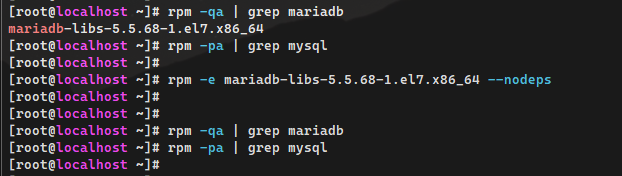

# 二、下载安装包

官网下载：https://downloads.mysql.com/archives/community/
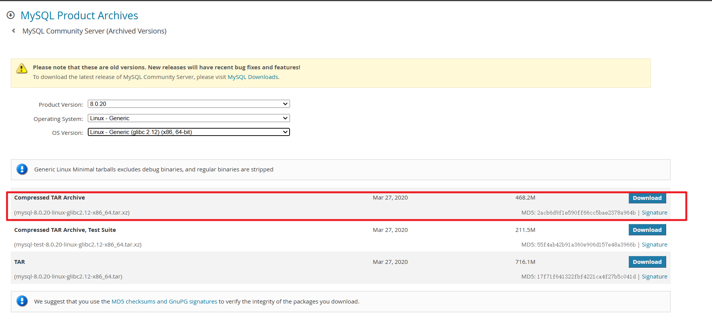

# 三、创建目录

```
## 安装包目录
mkdir -p /data/install_pkg

## 安装目录
mkdir -p /data/mysql_app/

## 数据目录
mkdir -p /data/mysql_data/mysql
```

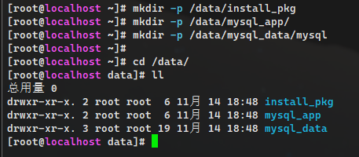


# 四、解压缩&重命名

```
## 将安装包放置/data/install_pkg中
cd /data/install_pkg
tar -xf mysql-8.0.20-linux-glibc2.12-x86_64.tar.xz
mv mysql-8.0.20-linux-glibc2.12-x86_64 /data/mysql_app/

## 解压后移动到安装目录中并修改文件夹名称
cd /data/mysql_app/
mv mysql-8.0.20-linux-glibc2.12-x86_64 mysql
```

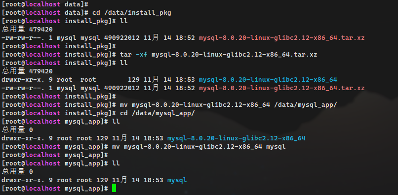

# 五、修改环境变量:

```
## 打开配置文件
vim /etc/profile
## 末尾增加
export PATH=/data/mysql_app/mysql/bin:$PATH
## 生效环境变量
source /etc/profile
```

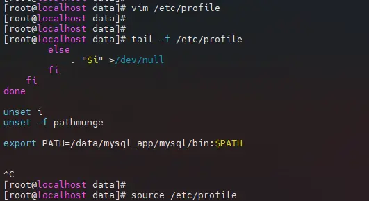

# 六、创建mysql用户并赋权

```
## 新建用户（如有则跳过）
groupadd mysql
useradd mysql  -g mysql -d /home/mysql 
passwd mysql (设置为mysql)
## 赋权
chown -R mysql.mysql /data/install_pkg
chown -R mysql.mysql /data/mysql_app
chown -R mysql.mysql /data/mysql_data
```

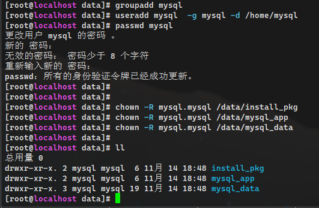

# 七、初始化数据（建库）

```
## 初始化：生成临时密码
mysqld --initialize  --user=mysql --basedir=/data/mysql_app/mysql --datadir=/data/mysql_data/mysql

## 补充：还可初始化为空密码
mysqld --initialize-insecure --user=mysql --basedir=/data/mysql_app/mysql --datadir=/data/mysql_data/mysql
```

**这里采用第一种方式初始化**
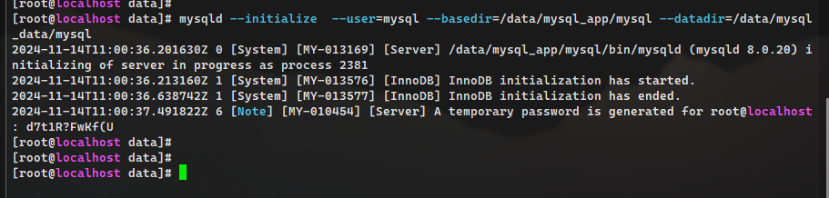


# 八、书写默认配置文件

```
vim /etc/my.cnf
[mysqld]
user=mysql
basedir=/data/mysql_app/mysql
datadir=/data/mysql_data/mysql
server_id=6
port=3306
socket=/tmp/mysql.sock
[mysql]
socket=/tmp/mysql.sock
prompt= [\u 3306][DB: \d] mysql >
```

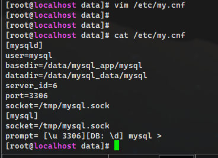

#九、配置启动脚本

```
cd /data/mysql_app/mysql/support-files
./mysql.server start
cp mysql.server    /etc/init.d/mysqld
```

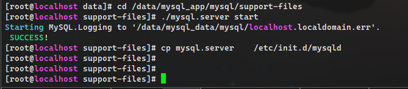


# 十、使用systemd管理mysql

```
vim /etc/systemd/system/mysqld.service 
[Unit]
Description=MySQL Server
Documentation=man:mysqld(8)
Documentation=http://dev.mysql.com/doc/refman/en/using-systemd.html
After=network.target
After=syslog.target
[Install]
WantedBy=multi-user.target
[Service]
User=mysql
Group=mysql
ExecStart=/data/mysql_app/mysql/bin/mysqld --defaults-file=/etc/my.cnf
LimitNOFILE = 5000
```

> 注意：将原来模式启动mysqld先关闭，然后再用systemd管理。
> systemctl  start/stop/restart/status   mysqld

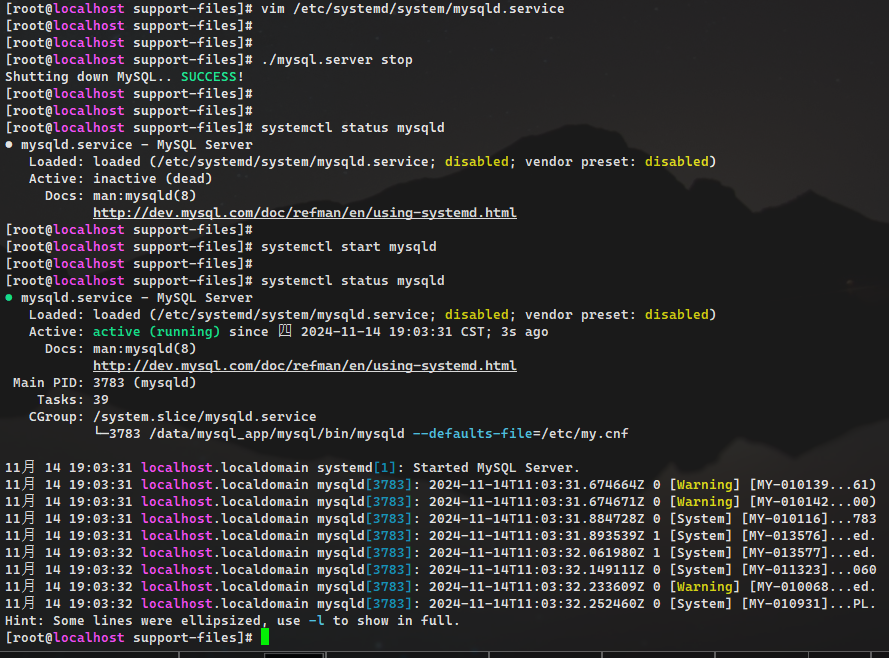

# 十一、安装后的简单管理

```
## 修改root用户密码（管理员密码，设置为mysql）
mysqladmin -uroot -p password
```

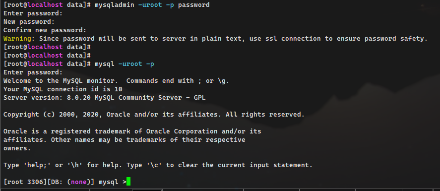


> 5.6版本:
> select user,password,host from mysql.user;
> 5.7 中用户基本信息:
> select user,authentication_string,host from mysql.user;
> desc  mysql.user;


十二、登录测试

```
msyql -uroot -p

TCP/IP方式（远程、本地）：
mysql -uroot -p -h XXXXXXXX -P3306
Socket方式(仅本地)：
mysql -uroot -p -S /tmp/mysql.sock
```

>问题：
>Enter password:
>ERROR 1130 (HY000): Host '192.168.174.143' is not allowed to connect to this MySQL server
>解决：
>mysql -uroot -p
>use mysql;
>select Host,User from user;
>update user set Host='%' where User ='root';
>flush privileges;
>重启 mysql 服务，输入命令 “ systemctl restart mysqld.service ”


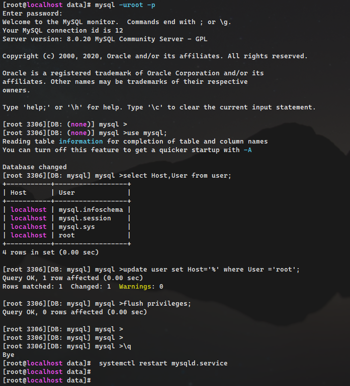

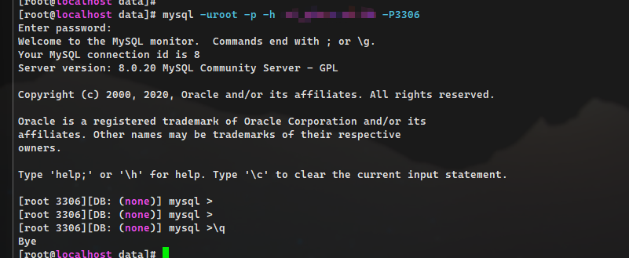


十三、设置开机自启动

```
sudo systemctl enable mysqld
```

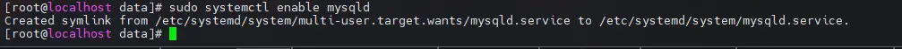