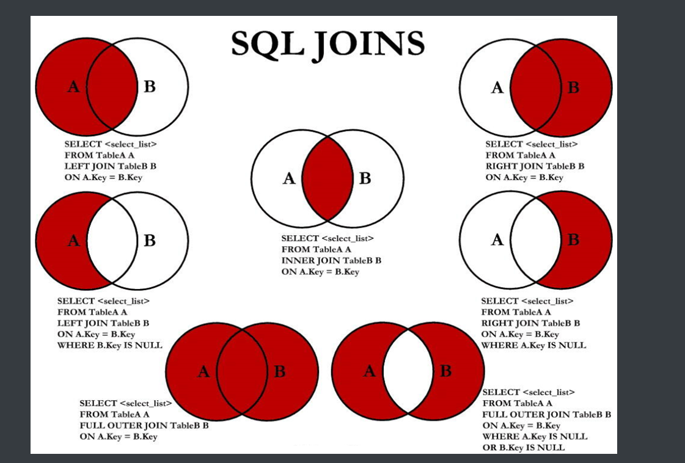

# 题目

[175. 组合两个表](https://leetcode.cn/problems/combine-two-tables/)

表: `Person`

```
+-------------+---------+
| 列名         | 类型     |
+-------------+---------+
| PersonId    | int     |
| FirstName   | varchar |
| LastName    | varchar |
+-------------+---------+
personId 是该表的主键（具有唯一值的列）。
该表包含一些人的 ID 和他们的姓和名的信息。
```

表: `Address`

```
+-------------+---------+
| 列名         | 类型    |
+-------------+---------+
| AddressId   | int     |
| PersonId    | int     |
| City        | varchar |
| State       | varchar |
+-------------+---------+
addressId 是该表的主键（具有唯一值的列）。
该表的每一行都包含一个 ID = PersonId 的人的城市和州的信息。
```

 编写解决方案，报告 `Person` 表中每个人的姓、名、城市和州。如果 `personId` 的地址不在 `Address` 表中，则报告为 `null` 。

以 **任意顺序** 返回结果表。

结果格式如下所示。

**示例 1:**

```
输入: 
Person表:
+----------+----------+-----------+
| personId | lastName | firstName |
+----------+----------+-----------+
| 1        | Wang     | Allen     |
| 2        | Alice    | Bob       |
+----------+----------+-----------+
Address表:
+-----------+----------+---------------+------------+
| addressId | personId | city          | state      |
+-----------+----------+---------------+------------+
| 1         | 2        | New York City | New York   |
| 2         | 3        | Leetcode      | California |
+-----------+----------+---------------+------------+
输出: 
+-----------+----------+---------------+----------+
| firstName | lastName | city          | state    |
+-----------+----------+---------------+----------+
| Allen     | Wang     | Null          | Null     |
| Bob       | Alice    | New York City | New York |
+-----------+----------+---------------+----------+
解释: 
地址表中没有 personId = 1 的地址，所以它们的城市和州返回 null。
addressId = 1 包含了 personId = 2 的地址信息。
```

# 思路

1、本题中，Person表没有city和 state，因此查询时需要关联Address表。

2、但Address表中city和 state可能有记录没有地址信息

3、使用默认的内连接，如果遇到null会查不出来，所以使用外连接

4、Person表的信息是全的，Address表的信息可能不全。所以外连接时，显示Person表全部信息

```mysql
SELECT t1.Firstname, t1.LastName, t2.City, t2.State
from Person t1 left join Address t2
on t1.PersonId = t2.PersonId;
```


# 心得  --- 相关知识点

## 内连接和外连接

(1) 左外连接（LEFT OUTER JOIN），结果保留左表的全部数据

(2) 右外连接（RIGHT OUTER JOIN），结果保留右表的全部数据

(3) 全外连接（FULL OUTER JOIN），结果是2个表的并集

(4) 内连接（INNER JOIN），两表的公共数据

(5) CROSS JOIN 交叉连接 结果是笛卡尔积，排列组合的所有情况



